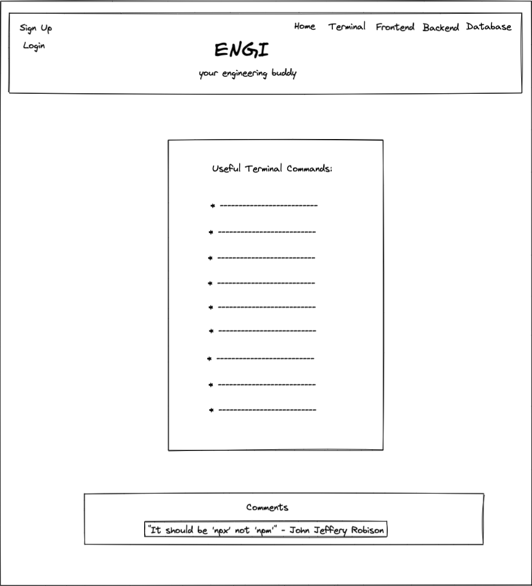
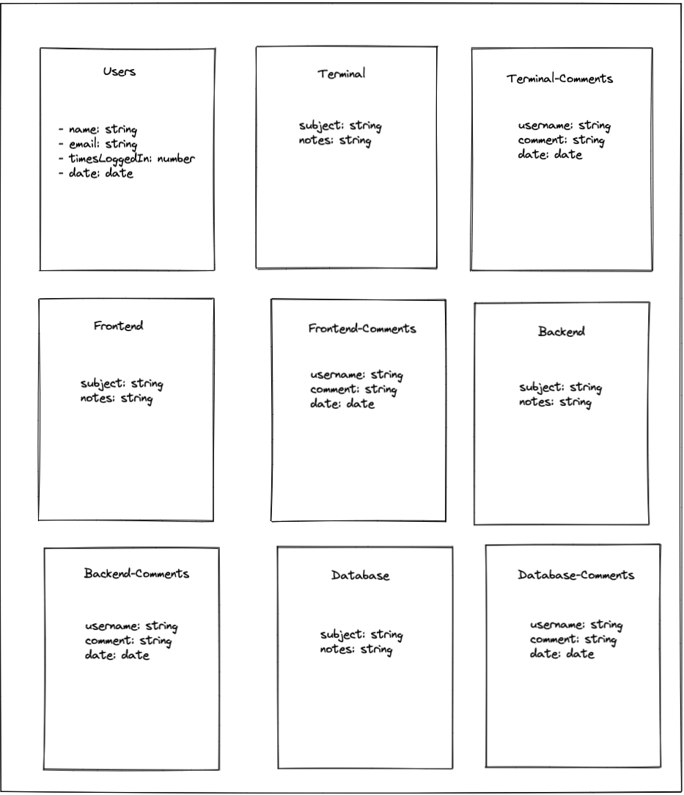

# Engi-api
Your Engineer Buddy!

<!-- ## Purpose of this application -->

## Technology Stack
MERN

## How does it work?
Engi is a Node.js Express application that uses Mongoose to connect to MongoDB.  The following dependencies were used:

<!-- ## Screenshots
### Front Page

### Log In

### 
 -->

## WIREFRAME

## ERD

## USER STORIES
### As a user I want to...
1. Log in.
2. View engineering notes.
3. Make comments.
4. See my comments.
5. Edit my comments.
6. Delete my comments.

### Additional details
- Who this is for: Software Engineers
- What this is for: To have a reference for engineering information.
- Why: To make Software engineers more effective.

<!-- ## Code Snippets -->
