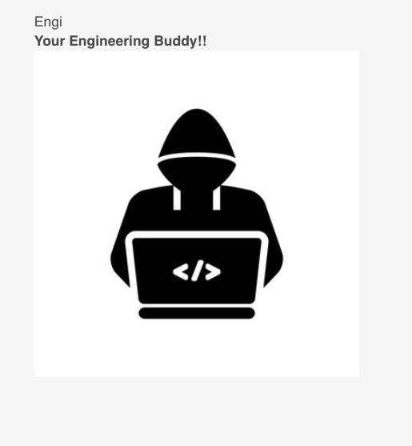
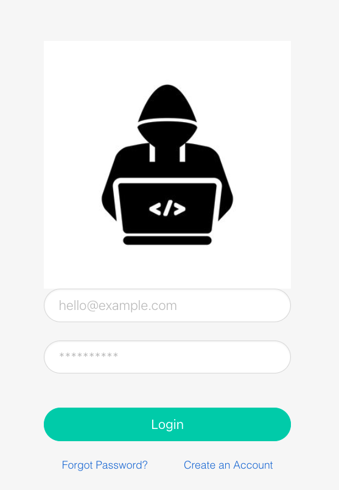
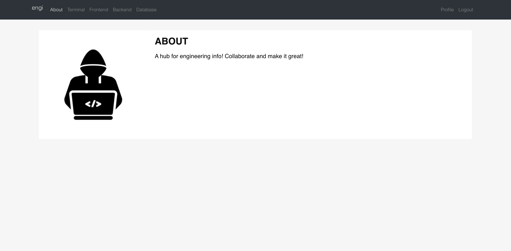

# Engi
Your Engineer Buddy!

## Purpose of this application
A place to get vetted notes by professionals for Software Engineering!

## Technology Stack
MERN

## How does it work?
Engi is a Node.js Express application that uses Mongoose to connect to MongoDB.  The following dependencies were used:

```
"dependencies": {
    "axios": "^0.25.0",
    "bcryptjs": "^2.4.3",
    "cors": "^2.8.5",
    "dotenv": "^10.0.0",
    "express": "^4.17.2",
    "jsonwebtoken": "^8.5.1",
    "mongoose": "^6.1.8",
    "passport": "^0.5.0",
    "passport-jwt": "^4.0.0"
  }
```

## Screenshots
### Front Page

### Log In

### About


## WIREFRAME


## ERD


## USER STORIES
### As a user I want to...
1. Log in.
2. View engineering notes.
3. Make new notes.
4. See my notes.

### Additional details
- Who this is for: Software Engineers
- What this is for: To have a reference for engineering information.
- Why: To make Software engineers more effective.

## Code Snippets
Terminal 'Get' Route
```
router.get("/", async (request, response) => {

    console.log(request.body)
    response.send('ok');

    try {
        const terminalArray = await Terminal.find({});
        response.json({ terminalArray });
    } catch (error) {
        response.status(500).send(error);
    }
});
```